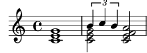

# memol - a music description language

memol is a music description language which features:

* **Well-structured**
	* Essentially, memol describes a score as recursive composition of two
	  constructs only: group "[...]" and chord "(...)".
* **Orthogonal**
	* Some musical elements like scale, chord and backing pattern can be
	  described independently and composite them each other.  "with" syntax
	  enables (some of) them in a unified form.  Expressions (note velocity,
	  control change, ...) are also described separately.
* **Focused on musical composition**
	* Language design and implementation help trial-and-error of musical
	  composition well (in the future).  Unlike score typesetting languages,
	  memol also focused on describing time-dependent value used for MIDI
	  control changes, etc.

## Example

	score $out.0() = { (c E G) | (c E G [B C b]) (c E F A) }

## Documentation

http://mimosa-pudica.net/memol/tutorial/
